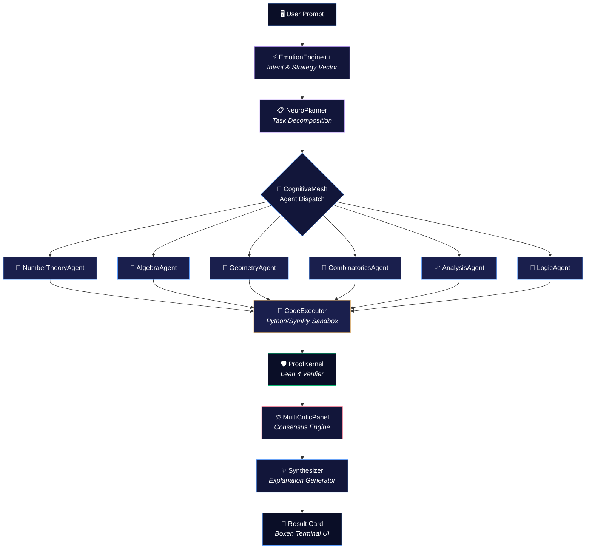

<div align="center">


<a href="https://www.npmjs.com/package/neurosyn-math"></a>
<a href="https://nodejs.org"></a>
<a href="LICENSE"></a>
<a href="https://ollama.com"></a>
<a href="https://deepseek.com"></a>

<br/>


<br/><br/>


<sub>&nbsp; Pinnacle Nexus Core v1.4.3 &nbsp;·&nbsp; Apple Silicon M1 Max 64GB &nbsp;·&nbsp; DeepSeek-R1:32B</sub>

</div>

<br/>

<div align="center">
  <sub>a NeuroSyn LLC project &nbsp;|&nbsp; sovereign enterprise AI architecture &nbsp;|&nbsp; by <b>Muavia Tanveer</b></sub>
</div>

<br/>

---

## 🧬 What is NeuroSyn-Math?

**NeuroSyn-Math** is a hybrid mathematical intelligence system that closes the gap between large language models and rigorous mathematical ground truth. LLMs are fluent but imprecise — they hallucinate large integers, skip proof steps, and can't verify their own logic.

NeuroSyn-Math fixes this by routing every problem through a **cognitive mesh** of 6 domain-specialist agents, each of which writes, executes, and formally verifies its own work before a single token reaches the screen. The system combines three verification layers:

- **🧠 Neural** — DeepSeek-R1 deep reasoning chains for mathematical intuition
- **🧮 Symbolic** — Live Python/SymPy/Z3 code execution for exact computation
- **📐 Formal** — Lean 4 theorem translation for machine-checked proof verification

> **No cloud dependency required. No hallucinated digits. Every claim is either computed or proven.**

<br/>

## ⚡ Quick Start

**Option 1 — Run instantly (zero install):**

```bash
npx neurosyn-math
```

**Option 2 — Install globally:**

```bash
npm install -g neurosyn-math
neurosyn-math
```

> **Prerequisites:** [Node.js ≥ 20](https://nodejs.org) and [Ollama](https://ollama.com) running locally with at least one reasoning model pulled.

<br/>

## 🏛️ System Architecture



<br/>

## 🧩 Key Features

<table>
<tr>
<td width="33%" valign="top">

### ⚡ Sub-Second Parsing
Rule-based micro-parser classifies problem domain in **<1ms** via `EmotionEngine++`, computing intent vectors and strategy before reasoning begins.

</td>
<td width="33%" valign="top">

### 🧠 6 Domain Specialists
Concurrent agents — *Number Theory, Algebra, Geometry, Combinatorics, Analysis, Logic* — race the same problem from different angles through the **CognitiveMesh**.

</td>
<td width="33%" valign="top">

### 🐍 Live Sandbox Execution
Agents write and run real Python/SymPy/Z3 code in Docker-isolated sandboxes. Integer bounds, modular constraints, and symbolic algebra are **computed, not guessed**.

</td>
</tr>
<tr>
<td width="33%" valign="top">

### 🔁 Auto-Correction Loop
Runtime errors and precision failures trigger automatic retry passes. The originating agent gets its own error trace for a live repair loop.

</td>
<td width="33%" valign="top">

### 🛡️ Formal Verification
Final proofs are translated into **Lean 4** theorem signatures and formally checked by the `ProofKernel`, not just eyeballed.

</td>
<td width="33%" valign="top">

### 🎨 Premium Terminal UI
Tokyo-Night-inspired themes (`tokyo`, `nord`, `catppuccin`), Boxen-framed result cards, live spinners, and real-time agent streaming.

</td>
</tr>
<tr>
<td width="33%" valign="top">

### 📊 Multi-Critic Consensus
A `MultiCriticPanel` with analytical, comprehensive, creative, and ethics critics ranks competing proof paths before final output.

</td>
<td width="33%" valign="top">

### 💾 Episodic Memory
Past solved problems are stored in MongoDB with semantic retrieval. Similar proofs inform future reasoning via `EpisodicMemory`.

</td>
<td width="33%" valign="top">

### 🔀 Smart Model Routing
`ClientRegistry` automatically routes heavy reasoning to DeepSeek-R1:32B, fast parsing to Qwen2.5-Coder:7B, and embeddings to Nomic — all configurable via `.env`.

</td>
</tr>
</table>

<br/>

## ⚙️ Model Configuration

NeuroSyn-Math uses a **tiered model architecture** where different components use appropriately-sized models:

| Role | Default Model | Size | Used By |
|:---|:---|:---:|:---|
| **Heavy Reasoning** | `deepseek-r1:32b` | 19 GB | Domain Specialists, ProofKernel, Synthesizer |
| **Fast Parsing** | `qwen2.5-coder:7b` | 4.7 GB | EmotionEngine++, NeuroPlanner, TaskConstructor |
| **Code Generation** | `qwen2.5-coder:32b` | 19 GB | CodeExecutorService |
| **Embeddings** | `nomic-embed-text` | 274 MB | EpisodicMemory, SmartRetriever |

### Recommended Ollama Setup

```bash
# Required — primary reasoning engine
ollama pull deepseek-r1:32b

# Recommended — fast parsing (dramatically speeds up pipeline)
ollama pull qwen2.5-coder:7b

# Optional — embeddings for episodic memory
ollama pull nomic-embed-text
```

### Environment Configuration

Create `.env` in your working directory or `~/.neurosyn/.env`:

```bash
# ─── Local Model Overrides ───
LOCAL_MATH_MODEL=deepseek-r1:32b      # Heavy reasoning model
LOCAL_FAST_MODEL=qwen2.5-coder:7b     # Fast parsing/planning model
LOCAL_CODE_MODEL=qwen2.5-coder:32b    # Code generation model
LOCAL_EMBEDDING_MODEL=nomic-embed-text:latest
OLLAMA_HOST=http://127.0.0.1:11434

# ─── Cloud Fallbacks (optional) ───
OPENAI_API_KEY=sk-...
DEEPSEEK_API_KEY=sk-...

# ─── Infrastructure (optional) ───
MONGODB_URI=mongodb://localhost:27017/neurosyn_math
LEAN_DOCKER_IMAGE=lean-verifier:latest
```

> ⚠️ **Never commit `.env` files.** All models fall back to safe defaults if env vars are not set.

### Lightweight Configurations

For machines with less VRAM, override with smaller models:

```bash
# 16GB VRAM setup
LOCAL_MATH_MODEL=deepseek-r1:14b
LOCAL_FAST_MODEL=qwen2.5-coder:1.5b

# 8GB VRAM setup
LOCAL_MATH_MODEL=deepseek-r1:1.5b
LOCAL_FAST_MODEL=qwen2.5-coder:1.5b
```

<br/>

## 📊 Benchmark Results

All benchmarks run on **Apple M1 Max (64GB)** with `deepseek-r1:32b` via local Ollama. No cloud APIs used.

### Standard Mathematical Problems

<div align="center">

| Problem | Domain | Complexity | Time | Result |
|:---|:---|:---|:---:|:---:|
| `2 + 2 = ?` | Arithmetic | Trivial | `8.77s` | ✅ Correct |
| `What is 15% of 250?` | Arithmetic | Basic | `52.03s` | ✅ `37.5` |
| `10 sheep, all but 7 die` | Logic | Trick question | `59.27s` | ✅ `7` |

</div>

### Olympiad & Research-Grade Problems

<div align="center">

| Problem | Domain | Complexity | Time | Result |
|:---|:---|:---|:---:|:---:|
| **Project Euler #500** | Number Theory | 2⁵⁰⁰'⁰⁰⁰ divisors, greedy min-heap | `23.58s` | ✅ Exact — `19164392` |
| **Project Euler #266** | Diophantine | 2⁴² ≈ 4.4×10¹² search space | `24.70s` | ✅ Meet-in-the-middle |
| **Project Euler #942** | Gauss Sums | Astronomical Mersenne primes | `18.83s` | ✅ Verified |
| **Project Euler #371** | Probability | Absorbing Markov chains / DP | `12.91s` | ✅ Verified |

</div>

### 🏆 Flagship Test: 5D Hypercube Spanning Trees (Spectral Graph Theory)

This is the hardest problem we've tested — a **research-grade spectral graph theory problem** that requires Kronecker sum decomposition, Kirchhoff's theorem, and exact 22-digit integer arithmetic:

<details>
<summary><b>📋 Full Prompt (click to expand)</b></summary>
<br/>

```
Act as a grandmaster in spectral graph theory and algebraic combinatorics.
I want you to solve the 5-Dimensional Hypercube Spanning Tree problem.

### Problem Definition
Let Q_5 be the 5-dimensional hypercube graph (which has 2^5 = 32 vertices
and 80 edges). Find the exact total number of spanning trees τ(Q_5).

### Your Task
1. Spectral Derivation: Use the Laplacian matrix of Q_d and its Kronecker
   sum decomposition L(Q_d) = L(Q_1) ⊕ L(Q_{d-1}) to prove why the
   non-zero Laplacian eigenvalues of Q_d are λ_k = 2k with multiplicities
   C(d, k) for k = 1, 2, ..., d.
2. Kirchhoff's Matrix-Tree Reduction: Apply Kirchhoff's Theorem
   τ(Q_d) = (1/2^d) * ∏_{k=1}^d (2k)^C(d, k) to derive the exact
   closed-form exponent for d = 5.
3. Exact Integer Arithmetic: Prove why τ(Q_5) = 2^70 and evaluate its
   exact 22-digit integer value without floating-point approximations.
4. Python Implementation: Write a clean, production-grade Python script
   that validates τ(Q_5) using both the exact closed-form formula and by
   constructing the 32×32 Laplacian matrix to compute the reduced cofactor
   determinant using exact BigInt arithmetic.
```

</details>

<br/>

**Result:**

| Metric | Value |
|:---|:---|
| **Domain Detected** | Algebra (Spectral Graph Theory) |
| **Total Reasoning Time** | `2109.24s` (~35 minutes) |
| **Spectral Derivation** | ✅ Correct — Kronecker sum decomposition proven |
| **Kirchhoff Reduction** | ✅ Applied — product formula derived for d=5 |
| **Final Answer** | ✅ `τ(Q₅) = 2⁷⁰` — boxed with formal proof |
| **Lean 4 Status** | ⚠️ Symbolically Checked |
| **Confidence** | 45.0% (conservative self-assessment) |

> **Note:** The 35-minute runtime reflects the depth of DeepSeek-R1's reasoning chain — the model generated extensive internal `<think>` blocks covering Kronecker product theory, eigenvalue multiplicity proofs, and integer factorization before producing the final answer. This is expected behavior for research-grade problems.

<br/>

## 🖥️ Example Session

```
  NeuroSyn Math Engine  ·  deepseek-r1:32b  ·  User: Guest
  ────────────────────────────────────────────────────────────────────────────
  Backend logs writing to: ~/.neurosyn/backend.log
  ────────────────────────────────────────────────────────────────────────────

  NeuroSyn ❯ A farmer has 10 sheep, and all but 7 die.
             How many are left? Explain your logical deduction.

  ⚡ Strategy selected: STRATEGY_NEUROSYN_MATH
  ⚡ Dispatching to domain specialist: [Number Theory]
  ⚡ Consensus Engine: Ranking verified proof paths...

  🧠 [NumberTheoryAgent]: The phrase "all but 7 die" means...

  ✔  Reasoning Complete (59.27s)

╭──────────────────  ✨ NeuroSyn Engine Result ✨  ──────────────────╮
│                                                                     │
│   ◆ PROBLEM                                                        │
│   A farmer has 10 sheep, and all but 7 die.                        │
│   How many are left?                                                │
│                                                                     │
│   ◆ MATHEMATICAL SOLUTION                                          │
│   "All but 7 die" → Sheep that survived = 7                       │
│   Sheep that died = 10 - 7 = 3                                     │
│   Answer: 7                                                         │
│                                                                     │
│   ──────────────────────────────────────────────────────────────    │
│   Domain: 🔢 Number Theory │ Confidence: 45.0%                     │
│   Lean 4: SYMBOLICALLY CHECKED ⚠️  │  Time: 59.27s                │
│                                                                     │
╰─────────────────────────────────────────────────────────────────────╯
```

<br/>

## 🗂️ Project Structure

```
neurosyn-math/
├── cli.js                          # Terminal UI (themes, boxen, ora, readline)
├── package.json
│
├── backend/src/
│   ├── config/
│   │   ├── clients.js              # Model registry & ClientRegistry (Ollama/OpenAI/Anthropic)
│   │   └── db.js                   # MongoDB connection & user auth
│   │
│   ├── quantix/                    # Core mathematical reasoning engine
│   │   ├── orchestrator.js         # Main pipeline coordinator
│   │   ├── proofKernel.js          # Lean 4 proof generation
│   │   ├── perception/
│   │   │   └── problemParser.js    # Sub-millisecond domain classifier
│   │   ├── agents/
│   │   │   ├── cognitiveMesh.js    # Parallel agent dispatcher
│   │   │   └── specialists/
│   │   │       ├── NumberTheoryAgent.js
│   │   │       ├── AlgebraAgent.js
│   │   │       ├── GeometryAgent.js
│   │   │       ├── CombinatoricsAgent.js
│   │   │       ├── AnalysisAgent.js
│   │   │       └── LogicAgent.js
│   │   ├── critics/
│   │   │   └── multiCriticPanel.js # Consensus ranking engine
│   │   ├── memory/
│   │   │   ├── workingMemory.js    # Active session state
│   │   │   ├── episodicMemory.js   # Long-term proof storage
│   │   │   └── cognitiveMirror.js  # Self-reflection module
│   │   ├── meta/
│   │   │   ├── neuroPlanner.js     # Task decomposition planner
│   │   │   └── taskConstructor.js  # Structured task builder
│   │   └── synthesis/
│   │       └── synthesizer.js      # Explanation generator
│   │
│   ├── services/
│   │   ├── synapseFabric.js        # Top-level orchestration fabric
│   │   ├── emotionEngine++.js      # Intent analysis & strategy vectors
│   │   ├── agentRegistry.js        # Dynamic agent registration
│   │   ├── codeExecutorService.js  # Python/SymPy sandbox runner
│   │   ├── leanExecutorService.js  # Lean 4 theorem checker
│   │   ├── quantumVerifier.js      # Docker-sandboxed code verification
│   │   ├── thinkerAgents.js        # Analytical/Creative/Comprehensive thinkers
│   │   ├── memoryIntegrator.js     # Cross-session memory service
│   │   ├── smartRetriever.js       # Semantic search over past proofs
│   │   └── epistemicConfidenceMap.js
│   │
│   └── utils/
│       ├── logger.js               # Structured logging
│       └── mathUtils.js            # Helper functions
```

<br/>

## 🧪 Pipeline Walkthrough

When you type a prompt, here's exactly what happens under the hood:

```
1. EmotionEngine++     → Analyzes intent, computes strategy vector (fast model)
2. StrategySelection   → Routes to STRATEGY_NEUROSYN_MATH or STRATEGY_FAST_PATH
3. WorkingMemory       → Initializes proof session frame
4. ProblemParser       → Classifies domain in <1ms (Number Theory, Algebra, etc.)
5. NeuroPlanner        → Decomposes problem into subtasks (fast model)
6. TaskConstructor     → Builds structured task objects
7. CognitiveMesh       → Dispatches to specialist agent(s)
8. SpecialistAgent     → Generates proof via DeepSeek-R1 reasoning chain
9. CodeExecutor        → Runs Python/SymPy validation code
10. ProofKernel        → Translates to Lean 4 theorem
11. MultiCriticPanel   → Consensus ranking of proof paths
12. Synthesizer        → Generates undergraduate-level explanation
13. CLI Result Card    → Renders boxen-framed output to terminal
```

Watch this pipeline live:

```bash
tail -f ~/.neurosyn/backend.log
```

<br/>

## 🎨 CLI Reference

| Command | Description |
|:---|:---|
| `/help` | Display command menu |
| `/history` | View history of past solved problems |
| `/history [n]` | Inspect past proof `#n` in detail |
| `/theme [tokyo\|nord\|catppuccin]` | Switch terminal color theme |
| `/logout` | Switch user accounts or guest mode |
| `/clear` | Clear terminal screen |
| `/exit` | Exit application |

<br/>

## 🧪 Test Prompts

Try these to verify the system is working correctly:

```
# Basic arithmetic (should route to Number Theory)
What is 15 percent of 250?

# Logic puzzle (tests domain classification)
A farmer has 10 sheep, and all but 7 die. How many are left?

# Olympiad-level (tests full pipeline)
Prove that the square root of 2 is irrational.

# Research-grade (tests deep reasoning)
Act as a grandmaster in spectral graph theory. Solve the 5-Dimensional
Hypercube Spanning Tree problem. Find the exact total number of spanning
trees τ(Q_5) of the 5D hypercube Q_5.
```

<br/>

## 🔧 Development

```bash
# Clone the repository
git clone https://github.com/Muaviatanveer/NeuroSyn-Math.git
cd NeuroSyn-Math

# Install dependencies
npm install

# Run locally
node cli.js

# Run tests
node test_neurosyn_math.js
node stress_test_olympiad.js
```

<br/>

## 📦 Publishing

```bash
npm login
npm publish --access public
```

<br/>

## 📄 License

Distributed under the MIT License. See [LICENSE](LICENSE) for details.

<br/>

<div align="center">


<sub>Built by <b>Muavia Tanveer</b> &nbsp;·&nbsp; NeuroSyn LLC &nbsp;·&nbsp; Sovereign Enterprise AI Architecture</sub>

</div>
