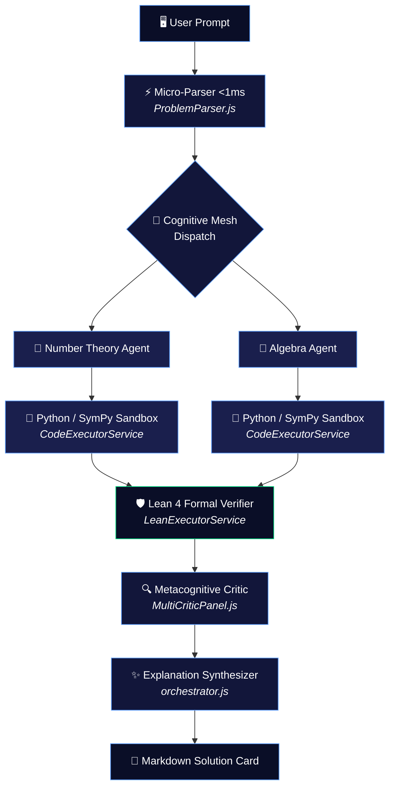

<div align="center">


<a href="https://www.npmjs.com/package/neurosyn-math"></a>
<a href="https://nodejs.org"></a>
<a href="LICENSE"></a>
<a href="https://ollama.com"></a>

<br/>


<br/><br/>


<sub>&nbsp; Sovereign Vaults Runtime &nbsp;·&nbsp; M1 Max 64GB &nbsp;·&nbsp; DeepSeek-R1</sub>

</div>

<br/>

<div align="center">
  <sub>a NeuroSyn LLC project &nbsp;|&nbsp; sovereign enterprise AI architecture</sub>
</div>

<br/>

---

## Overview

**NeuroSyn-Math** closes the gap between large language models and rigorous mathematical ground truth. LLMs are fluent but imprecise — they hallucinate large integers, skip proof steps, and can't verify their own logic. NeuroSyn-Math fixes this by routing every problem through a **cognitive mesh** of domain-specialist agents, each of which writes, executes, and formally verifies its own work before a single token reaches the screen.

No cloud dependency required. No hallucinated digits. Every claim is either computed or proven.

<br/>

## Key Features

<table>
<tr>
<td width="33%" valign="top">

### ⚡ Sub-Second Parsing
Rule-based micro-parser classifies problem domain in **&lt;1ms**, bypassing LLM latency before reasoning even begins.

</td>
<td width="33%" valign="top">

### 🧠 Parallel Cognitive Mesh
Concurrent specialist agents — *Number Theory, Algebra, Combinatorics, Geometry* — race the same problem from different angles.

</td>
<td width="33%" valign="top">

### 🐍 Live Sandbox Execution
Agents write and run real Python/SymPy/Z3 code in isolation to check integer bounds and modular constraints — no guessing.

</td>
</tr>
<tr>
<td width="33%" valign="top">

### 🔁 Auto-Correction Loop
Runtime or precision errors are caught and fed straight back to the originating agent for a live repair pass.

</td>
<td width="33%" valign="top">

### 🛡️ Formal Verification
Final proof steps are translated into **Lean 4** theorem signatures and formally checked, not just eyeballed.

</td>
<td width="33%" valign="top">

### 🎨 Themeable CLI
A Tokyo-Night-inspired terminal UI (`tokyo`, `nord`, `catppuccin`), with background logging and multi-line paste support.

</td>
</tr>
</table>

<br/>

## Architecture



<br/>

## Quick Start

**Option 1 — run instantly, no install:**

```bash
npx neurosyn-math
```

**Option 2 — install globally:**

```bash
npm install -g neurosyn-math
neurosyn-math
```

<br/>

## Setup

<details>
<summary><b>1. Local LLM (recommended)</b></summary>
<br/>

Install [Ollama](https://ollama.com) and pull the reasoning model:

```bash
ollama pull deepseek-r1:32b
# lighter machines:
ollama pull deepseek-r1:8b
```

</details>

<details>
<summary><b>2. Environment configuration</b></summary>
<br/>

Create a `.env` file in your working directory or `~/.neurosyn/.env`:

```bash
# Local Ollama configuration
LOCAL_MATH_MODEL=deepseek-r1:32b
OLLAMA_HOST=http://127.0.0.1:11434

# Optional: OpenAI fallback
OPENAI_API_KEY=your_openai_api_key_here

# Optional: Docker config for Lean 4
LEAN_DOCKER_IMAGE=lean-verifier:latest
```

> ⚠️ Never commit `.env` files or hardcode keys. Add `.env` to `.gitignore` before your first commit.

</details>

<br/>

## CLI Reference

| Command | Description |
|---|---|
| `/help` | Display command menu and help guide |
| `/history` | View history of past solved problems |
| `/history [n]` | Inspect past proof `#n` in detail |
| `/theme [tokyo\|nord\|catppuccin]` | Switch terminal theme |
| `/logout` | Switch user accounts or guest mode |
| `/clear` | Clear terminal screen |
| `/exit` | Exit application |

<br/>

## Benchmark Performance

<div align="center">

| Problem | Domain | Complexity | Time | Result |
|:---|:---|:---|:---:|:---:|
| **Project Euler 500** | Number Theory | 2⁵⁰⁰,⁰⁰⁰ divisors (greedy min-heap) | `23.58s` | ✅ Exact — `19164392` |
| **Project Euler 266** | Diophantine | 2⁴² ≈ 4.4×10¹² search space (meet-in-the-middle) | `24.70s` | ✅ Exact integer search |
| **Project Euler 942** | Gauss Sums | Astronomical Mersenne primes (Mq = 2q−1) | `18.83s` | ✅ Verified |
| **Project Euler 371** | Probability | Absorbing Markov chains / expected-value DP | `12.91s` | ✅ Verified |

</div>

<br/>

## Example Session

```
  NeuroSyn Math Engine  ·  deepseek-r1:32b  ·  User: Guest
  ────────────────────────────────────────────────────────────────────────
  Backend logs writing to: ~/.neurosyn/backend.log
  ────────────────────────────────────────────────────────────────────────

  NeuroSyn ❯ Act as a grandmaster in computational number theory.
             Solve Project Euler Problem 500.

  ✔  Reasoning complete (23.58s)

  ────────────────────────────────────────────────────────────────────────
  ◆ PROBLEM
  Find the smallest positive integer N with exactly 2^500000 divisors,
  modulo 500500507.

  ────────────────────────────────────────────────────────────────────────
  ◆ SOLUTION
  d(N) = (e₁+1)(e₂+1)... = 2^500000
  Each exponent must satisfy eᵢ = 2^k − 1.
  Cost to double divisor count via prime p: p^(2^k).
  → Greedily select smallest-cost factors using a min-heap.

  ────────────────────────────────────────────────────────────────────────
  Domain: Number Theory  │  Confidence: 100.0%  │  Lean 4: CHECKED ✓
  Time: 23.58s
```

<br/>

## Live Logging

Watch reasoning traces, sandbox output, and LLM steps in real time:

```bash
tail -f ~/.neurosyn/backend.log
```

<br/>

## Publishing

```json
{
  "name": "neurosyn-math",
  "version": "1.0.0",
  "description": "Multi-agent local LLM mathematical reasoning engine & CLI",
  "main": "cli.js",
  "type": "module",
  "bin": { "neurosyn-math": "./cli.js" },
  "scripts": { "start": "node cli.js" },
  "keywords": ["ai","math","number-theory","cli","ollama","deepseek","sympy","lean4","agents"],
  "author": "Muavia Tanveer",
  "license": "MIT"
}
```

```bash
npm login
npm publish --access public
```

<br/>

## License

Distributed under the MIT License. See [LICENSE](LICENSE) for details.

<br/>

<div align="center">


<sub>Built by <b>Muavia Tanveer</b> &nbsp;·&nbsp; NeuroSyn LLC &nbsp;·&nbsp; Sovereign Enterprise AI Architecture</sub>

</div>
